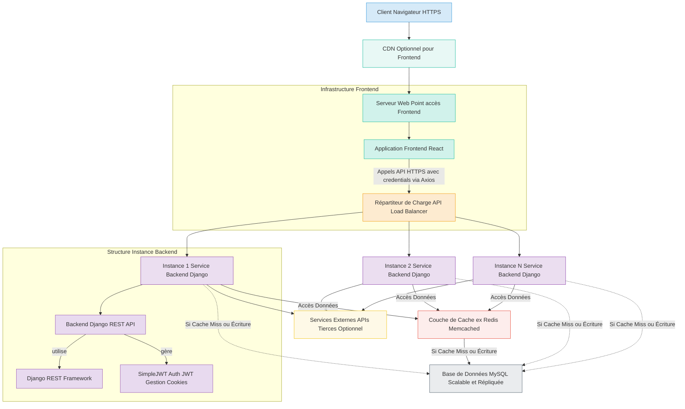

# Bloc1

```mermaid
graph TD
    A[Client Navigateur HTTPS] --> CDN[CDN Optionnel pour Frontend];
    CDN --> FELB[Serveur Web Point accès Frontend];

    subgraph Infrastructure Frontend
        FELB --> ReactApp[Application Frontend React];
        ReactApp -- Appels API HTTPS avec credentials via Axios --> APILB;
    end

    APILB[Répartiteur de Charge API Load Balancer];

    APILB --> BE1[Instance 1 Service Backend Django];
    APILB --> BE2[Instance 2 Service Backend Django];
    APILB --> BEN[Instance N Service Backend Django];

    subgraph Structure Instance Backend
        BE1 --> DjangoApp1[Backend Django REST API];
        DjangoApp1 -- utilise --> DRF1[Django REST Framework];
        DjangoApp1 -- gère --> Auth1[SimpleJWT Auth JWT Gestion Cookies];
    end
    %% Note: La structure interne de BE2 et BEN est similaire à BE1

    BE1 -- Accès Données --> Cache[Couche de Cache ex Redis Memcached];
    BE2 -- Accès Données --> Cache;
    BEN -- Accès Données --> Cache;

    Cache -- Si Cache Miss ou Écriture --> DB[Base de Données MySQL Scalable et Répliquée];
    BE1 -. Si Cache Miss ou Écriture .-> DB;
    BE2 -. Si Cache Miss ou Écriture .-> DB;
    BEN -. Si Cache Miss ou Écriture .-> DB;

    %% Optionnel si le backend consomme des API externes
    BE1 --> ExtAPI[Services Externes APIs Tierces Optionnel];
    BE2 --> ExtAPI;
    BEN --> ExtAPI;

    classDef user fill:#D6EAF8,stroke:#3498DB;
    classDef cdn fill:#E8F8F5,stroke:#1ABC9C;
    classDef frontend fill:#D1F2EB,stroke:#1ABC9C;
    classDef loadbalancer fill:#FDEBD0,stroke:#F39C12;
    classDef backend_instance fill:#EBDEF0,stroke:#8E44AD;
    classDef backend_detail fill:#E8DAEF,stroke:#9B59B6;
    classDef cache fill:#FDEDEC,stroke:#E74C3C;
    classDef database fill:#EAECEE,stroke:#566573;
    classDef external fill:#FEF9E7,stroke:#F1C40F;

    class A user;
    class CDN cdn;
    class FELB,ReactApp frontend;
    class APILB loadbalancer;
    class BE1,BE2,BEN backend_instance;
    class DjangoApp1,DRF1,Auth1 backend_detail;
    class Cache cache;
    class DB database;
    class ExtAPI external;
```
